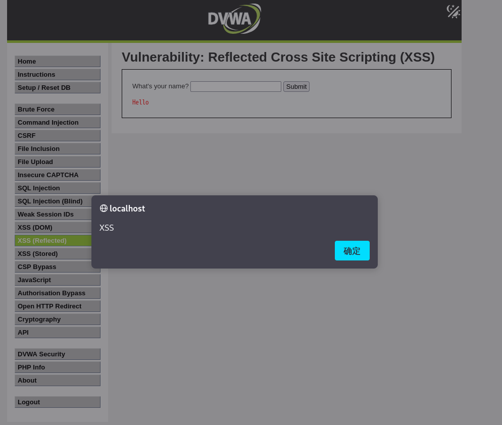

# DVWA XSS 漏洞复现练习项目

本项目演示了如何在 DVWA（Damn Vulnerable Web Application）中复现一个反射型 XSS（Cross-site Scripting）漏洞。

## ✅ 项目目标

- 了解 Reflected XSS 的基本原理
- 通过 DVWA 靶场复现该漏洞
- 学习攻击载荷的注入方式

## 🛠️ 技术栈

- Kali Linux
- Apache2 + PHP + MariaDB
- DVWA v1.10
- 浏览器：Firefox
- 工具：无

## 📷 实验截图

## 📄 报告文档

查看完整报告：[report/XSS漏洞复现报告.md](./report/XSS漏洞复现报告.md)
